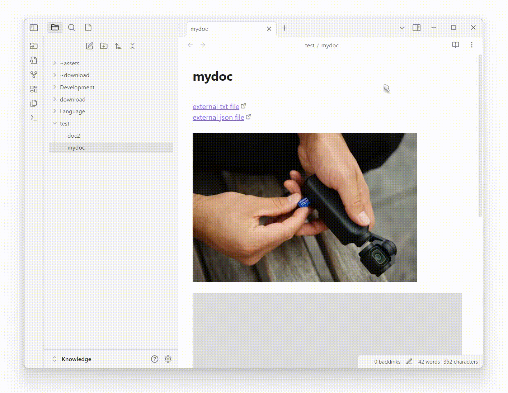

# Obsidian 插件：Local any files

[English](README.md) | 简体中文

这是一个功能强大的 Obsidian 插件，可以帮助你`提取外部链接`、`本地下载文件`和`替换外部链接`。

它支持多种文件类型，并提供灵活的配置选项来组织你的附件。

## 功能特点

- **广泛的文件类型支持**：预设多种文件类型分组
  - **图片**：`.png`、`.jpg`、`.jpeg`、`.gif`、`.bmp`、`.svg`、`.webp`、`.tiff`、`.ico`、`.raw`、`.heic`、`.heif`、`.avif`、`.jfif`
  - **办公文件**：`.doc`、`.docx`、`.xls`、`.xlsx`、`.ppt`、`.pptx`、`.pdf`、`.odt`、`.ods`、`.odp`、`.rtf`、`.txt`、`.csv`、`.epub`、`.pages`、`.numbers`、`.key`
  - **压缩包**：`.zip`、`.rar`、`.7z`、`.tar`、`.gz`、`.bz2`、`.xz`、`.iso`、`.tgz`、`.z`、`.bzip2`、`.cab`
  - **音乐**：`.mp3`、`.wav`、`.flac`、`.m4a`、`.ogg`、`.aac`、`.wma`、`.aiff`、`.alac`、`.mid`、`.midi`、`.opus`、`.amr`
  - **视频**：`.mp4`、`.avi`、`.mkv`、`.mov`、`.wmv`、`.flv`、`.webm`、`.m4v`、`.mpg`、`.mpeg`、`.3gp`、`.ogv`、`.ts`、`.vob`
  - **代码文件**：`.js`、`.ts`、`.jsx`、`.tsx`、`.html`、`.css`、`.scss`、`.json`、`.xml`、`.yaml`、`.yml`、`.md`、`.py`、`.java`、`.cpp`、`.c`、`.cs`、`.php`、`.rb`、`.go`、`.rs`、`.swift`
  - **字体**：`.ttf`、`.otf`、`.woff`、`.woff2`、`.eot`
  - **设计文件**：`.psd`、`.ai`、`.eps`、`.sketch`、`.fig`、`.xd`、`.blend`、`.obj`、`.fbx`、`.stl`、`.3ds`、`.dae`
  - **数据库**：`.sql`、`.db`、`.sqlite`、`.mdb`、`.accdb`、`.csv`、`.tsv`
  - **电子书**：`.epub`、`.mobi`、`.azw`、`.azw3`、`.fb2`、`.lit`、`.djvu`
  - **学术**：`.bib`、`.tex`、`.sty`、`.cls`、`.csl`、`.nb`、`.mat`、`.r`、`.rmd`、`.ipynb`

- **智能处理**：
  - 从笔记中提取链接
  - 本地下载文件
  - 自动替换为本地路径

- **直观的处理界面**：
  - 实时进度跟踪
  - 清晰的成功/失败指示
  - 详细的操作日志
  - 可视化进度条提供更好的反馈

- **灵活的处理范围**：
  - 仅处理当前文件
  - 处理当前文件夹
  - 处理库中所有文件
  - 通过右键菜单处理单个项目

- **独立的任务**：
  - `提取外部链接`：查找笔记中的所有外部链接
  - `本地下载文件`：将外部文件下载到你的库中
  - `替换外部链接`：更新链接以指向本地文件
  - 根据需要自定义运行哪些任务

- **可自定义的存储路径和文件名**：
  - 支持变量的动态存储路径：
    - `${path}`：当前笔记的路径
    - `${notename}`：当前笔记的名称
  - 灵活的文件命名支持变量：
    - `${originalName}`：原始文件名
    - `${date}`：当前日期
    - `${time}`：当前时间
    - `${md5}`：随机字符串

## 与 `obsidian-local-images` 的比较

虽然 `obsidian-local-images` 是一个专注于图片附件的优秀插件，但 `obsidian-local-any-files` 将类似功能扩展到了更广泛的文件类型：

- **文件类型支持**：
  - `obsidian-local-images`：仅专注于图片文件
  - `Local any files`：支持图片、文档、压缩包、媒体、代码文件等多种类型

- **处理选项**：
  - `obsidian-local-images`：处理当前笔记中的图片
  - `Local any files`：灵活的范围选项（当前文件、文件夹、整个库或单个项目）

- **配置**：
  - `obsidian-local-images`：基本的图片相关设置
  - `Local any files`：文件类型、存储路径和命名模式的丰富配置选项

- **组织方式**：
  - `obsidian-local-images`：标准的图片组织方式
  - `Local any files`：支持变量的自定义存储路径，实现更好的组织

## 使用方法

### 快速开始

1. 从 Obsidian 社区插件中安装本插件
2. 在设置中配置所需的文件类型：
   - 启用预设组（图片、文档等）
   - 根据需要添加自定义扩展名

### 处理文件

#### 方法一：命令面板
1. 打开命令面板（Ctrl/Cmd + P）
2. 搜索"Local any files"或"下载链接中的附件"
3. 在弹出的窗口中选择处理选项

#### 方法二：右键菜单
1. 在笔记中右键点击链接
2. 选择"下载到本地"选项
3. 在弹出的窗口中配置选项

### 配置

1. 打开设置：
   - 转到设置 > 社区插件 > Local any files > 设置

2. 文件类型配置：
   - 选择预设文件类型组
   - 添加自定义文件扩展名

3. 存储路径配置：
   - 设置基本存储路径
   - 使用变量自定义路径结构

4. 文件命名配置：
   - 选择命名模式
   - 使用变量自定义文件名
